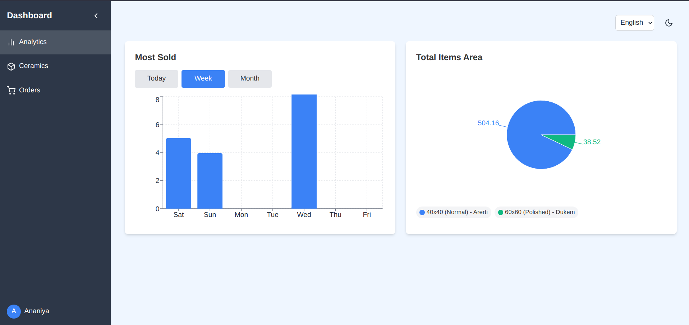
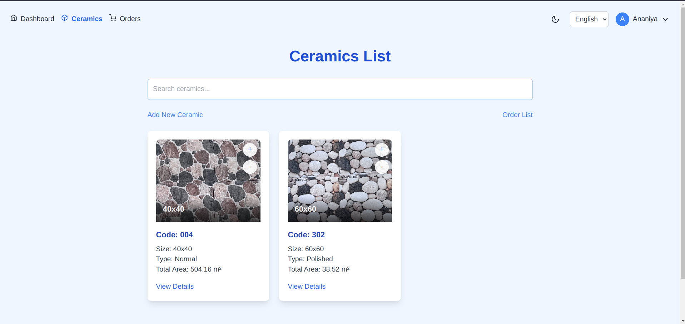
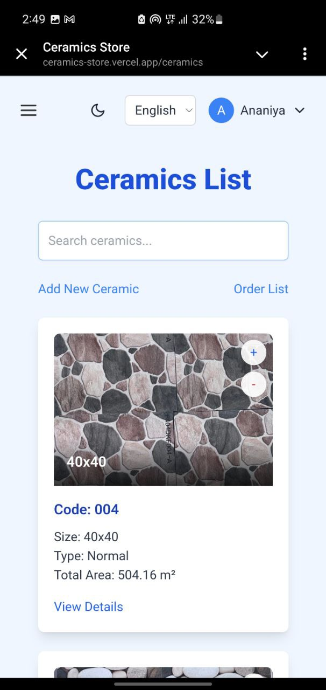

# Ceramics Store  

Welcome to **Ceramics Store**—an **Inventory Management** platform designed to help you showcase, manage, and organize your ceramic collections with ease. Built with **Next.js**, this project leverages modern web technologies to deliver a seamless and intuitive user experience. Whether you're a small business owner or a ceramic enthusiast, this platform is tailored to meet your inventory management needs.  

This project was built to help my family manage our ceramics shop more efficiently, providing an easy-to-use platform for tracking inventory, sales, and analytics.  

---

## 🌟 Key Features  

✅ **Dynamic Product Showcase** – Display ceramic items with high-quality images, detailed descriptions, and organized categories.  
✅ **Inventory Management** – Add, update, and remove ceramic items effortlessly.  
✅ **Responsive Design** – A mobile-friendly interface for managing inventory on any device.  
✅ **Dark Mode Support** – Toggle between light and dark themes for a comfortable viewing experience.  
✅ **Multi-language Support** – Switch between languages for a global audience.  
✅ **Analytics Dashboard** – Visualize sales and inventory data with interactive charts and graphs.  
✅ **Authentication** – Secure login and logout functionality for authorized users.  
✅ **Optimized Performance** – Built with **Next.js** for fast load times and smooth navigation.  
✅ **Server-side Rendering (SSR) & Static Generation (SSG)** – Enhanced performance with pre-rendering techniques.  
✅ **API Integration** – Fetch and manage data efficiently with built-in API routes.  

---

## 🚀 Getting Started  

Follow these steps to set up and run the project locally.  

### 🔹 1. Clone the Repository  

Open your terminal and run:  

```bash
git clone https://github.com/tsegaye27/ceramics-store.git
cd ceramics-store
```

### 🔹 2. Install Dependencies  

Make sure you have **Node.js** installed. Then, run:  

```bash
npm install
# or
yarn install
# or
pnpm install
```

### 🔹 3. Set Up Environment Variables  

Create a `.env.local` file in the root directory and add the following variables:  

```env
MONGODB_URI=your_mongodb_connection_string
JWT_SECRET=your_jwt_secret_key
NEXT_PUBLIC_API_URL=http://localhost:3000/api
```

Replace the placeholders with your actual MongoDB connection string and JWT secret key.  

### 🔹 4. Start the Development Server  

Run the following command to start the local development server:  

```bash
npm run dev
# or
yarn dev
```

Once the server is running, open your browser and visit:  

📝 **http://localhost:3000**

---

## 🛠️ Technologies Used  

- **Next.js** – React framework for server-side rendering and static site generation.  
- **Tailwind CSS** – Modern utility-first CSS framework for styling.  
- **MongoDB** – For inventory data storage.  
- **Recharts** – For interactive data visualization.  
- **React Icons** – For a wide range of icons.  
- **React Cookies** – For managing user authentication tokens.  
- **Axios** – For making HTTP requests.  
- **Framer Motion** – For smooth animations and transitions.  

---

## 📸 Screenshots    

### 1. **Dashboard**  
  
*Interactive analytics dashboard with charts and graphs.*  

### 2. **Inventory Management**  
  
*Easily manage your ceramic inventory with a clean and intuitive interface.*  

### 3. **Dark Mode**  
  
*Toggle between light and dark themes for a comfortable viewing experience.*  

### 4. **Mobile View**  
  
*Fully responsive design for seamless use on any device.*  

---

## 📝 License  

This project is licensed under the **MIT License**. See the [LICENSE](LICENSE) file for details.  

---

## 📧 Contact  

If you have any questions or suggestions, feel free to reach out:  

- **Email**: ttalegn29@gmail.com  
- **GitHub**: [tsegaye27](https://github.com/tsegaye27)  

---
